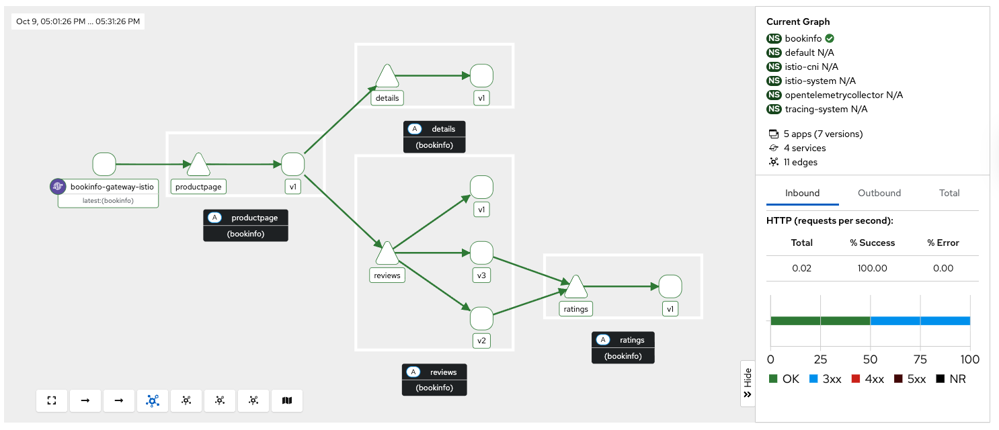

# Migrating from Sidecar to Ambient Mode (Tech Preview)

This guide provides a comprehensive, step-by-step process for migrating an existing OpenShift Service Mesh deployment from sidecar mode to ambient mode. The migration approach is designed to achieve a near zero-downtime transition while maintaining all security policies and service mesh functionality.

---

## 1. Overview of Sidecar to Ambient Migration

### 1.1 Migration Strategy

The migration from sidecar to ambient mode follows a **dual-proxy approach**:

1. **Gradual Transition**: Both sidecar and ambient proxies operate simultaneously during migration
2. **Service-by-Service**: Migration occurs incrementally, one service or namespace at a time
3. **Policy Preservation**: All existing security and traffic policies are maintained throughout the process
4. **Rollback Support**: Each step can be reversed if issues arise

### 1.2 Migration Benefits

Moving to ambient mode provides:
- **Reduced Resource Consumption**: Eliminates per-pod sidecar overhead
- **Simplified Operations**: No sidecar injection or restart requirements
- **Faster Pod Startup**: Applications start without waiting for sidecar initialization
- **Independent Proxy Lifecycle**: L7 proxies (waypoints) scale independently from applications

For more information on ambient mode benefits, see the [Introduction to Istio Ambient mode](../../README.adoc) guide.

### 1.3 Key Architectural Changes

| Component | Sidecar Mode | Ambient Mode |
|-----------|--------------|--------------|
| **L4 Processing** | Envoy sidecar per pod | ZTunnel node proxy (shared) |
| **L7 Processing** | Envoy sidecar per pod | Waypoint proxy per namespace/service |
| **mTLS Enforcement** | Sidecar proxy | ZTunnel proxy |
| **Policy Enforcement** | Sidecar proxy | ZTunnel (L4) + Waypoint (L7) |

---

## 2. Prerequisites

### 2.1 Technical Requirements

Before starting migration, ensure your environment meets these requirements:

- **OpenShift Container Platform 4.19+**: Required for supported Kubernetes Gateway API CRDs
- **OpenShift Service Mesh 3.2.0+**: Must be running OSSM operator version 3.2.0 or later
- **Istio v1.27+**: Control plane must be v1.27 or later for ambient support
- **Cluster Admin Access**: Required for namespace labeling and resource creation

### 2.2 Compatibility Validation

**Supported Features:**
- All L4 traffic policies (AuthorizationPolicy, PeerAuthentication)
- L7 traffic management (VirtualService, DestinationRule converted to HTTPRoute)
- Security policies (RequestAuthentication, AuthorizationPolicy)
- Telemetry and observability features

**Unsupported Features** (migration blockers):
- Multi-cluster mesh configurations
- Virtual Machine (VM) workload integration
- SPIRE integration for identity federation

### 2.3 Pre-Migration Checklist

**Environment Validation:**
```console
# Verify OSSM operator version
oc get csv -n openshift-operators | grep servicemesh
servicemeshoperator3.v3.2.0         Red Hat OpenShift Service Mesh 3   3.2.0       servicemeshoperator3.v3.1.3         Succeeded
```

```console
# Check Istio control plane version
oc get istio -n istio-system
NAME      NAMESPACE      PROFILE   REVISIONS   READY   IN USE   ACTIVE REVISION   STATUS    VERSION   AGE
default   istio-system             1           1       1        default           Healthy   v1.27.0   20m
```

```bash
# Verify no unsupported features are in use
oc get virtualservice,destinationrule,peerauthentication -A
```
Note: if you have any of the unsupported features listed above, resolve them before proceeding.


## Application Namespace Validation:

```console
# Check your application namespaces for sidecar injection
kubectl get namespaces -l istio.io/rev=default
NAME       STATUS   AGE
bookinfo   Active   6m56
```

```console
# Check current workloads with sidecar injection
kubectl get pods -n bookinfo
NAME                                      READY   STATUS    RESTARTS   AGE
bookinfo-gateway-istio-75d96b45d9-m65mq   1/1     Running   0          4m31s
details-v1-646f945867-2gg99               2/2     Running   0          6m6s
productpage-v1-7dbcd8849-4pmjt            2/2     Running   0          6m6s
ratings-v1-9bd8c8595-266zs                2/2     Running   0          6m6s
reviews-v1-5fd7b88d9-7vqxf                2/2     Running   0          6m5s
reviews-v2-54ff7fcf79-22k8r               2/2     Running   0          6m5s
reviews-v3-6445668877-gdr22               2/2     Running   0          6m5s
```

```console
# Check current gateway API being used
kubectl get gateway -n bookinfo
NAME               CLASS   ADDRESS       PROGRAMMED   AGE
bookinfo-gateway   istio   10.0.147.96   True         5m41s
```

Note: You can check that your application is getting requests trough the mesh by using Kiali. For example, in the Bookinfo application, you should see traffic flowing between the services on every request to the productpage:



For this migration example we are generating traffic to the productpage service using the following command:

```bash
# Generate traffic to productpage service
export INGRESS_HOST=$(kubectl get gtw bookinfo-gateway -n bookinfo -o jsonpath='{.status.addresses[0].value}')
export INGRESS_PORT=$(kubectl get gtw bookinfo-gateway -n bookinfo -o jsonpath='{.spec.listeners[?(@.name=="http")].port}')
export GATEWAY_URL=$INGRESS_HOST:$INGRESS_PORT
while true; do curl -s http://$GATEWAY_URL/productpage &> /dev/null; sleep 1; done
```

**Backup Existing Configuration:**
```bash
# Backup all Istio resources
oc get istio,istiocni,virtualservice,destinationrule,authorizationpolicy,requestauthentication -A -o yaml > istio-backup.yaml

# Backup namespace labels
oc get namespaces -o yaml > namespace-backup.yaml
```
Note: This backup is critical for rollback if issues arise during migration. Please add any resources specific to your environment that may not be covered here.
---

## 3. Migration Phases

This migration follows 9 phases in total. Each phase includes detailed steps, commands, and validation checks.

**Critical Sequencing Rules:**
- All waypoints must be enabled BEFORE removing any sidecars
- Policies must be migrated and validated BEFORE removing sidecar policies
- ZTunnel must be fully operational before enabling ambient mode

### Phase 1: Prerequisites Validation

Before starting migration, validate your cluster meets all requirements:

```console
# Check Istio state
oc get istio -n istio-system -o jsonpath='{.items[0].status.state}'
Healthy
```

```console
# Verify no unsupported features
oc get peerauthentication,virtualservice,destinationrule -A | grep -E "DISABLE|multi-cluster|vm-"
No resources found
```

```console
# Check cluster CNI compatibility
oc get network.operator cluster -o jsonpath='{.spec.defaultNetwork.type}'
OVNKubernetes
```

**Migration Blockers (must resolve before proceeding):**
- Multi-cluster mesh configurations
- VM workload integration
- SPIRE integration
- Istio version < 1.27

### Phase 2: Cluster Setup - Enable Ambient Support

Update your existing Istio resource:

```yaml
apiVersion: sailoperator.io/v1
kind: Istio
metadata:
  name: default
  namespace: istio-system
spec:
  version: v1.27.0
  namespace: istio-system
  updateStrategy:
    type: InPlace # Set you preferred update strategy
  profile: ambient
  values:
    pilot:
      trustedZtunnelNamespace: ztunnel
    meshConfig:
      discoverySelectors:
        - matchLabels:
            istio-discovery: enabled
    # Preserve existing customizations
    # Add any existing values configuration here
```

At this point the Istio control plane will be updated to support ambient mode. Take into account that at this point all the sidecars deployed can't handle HBONE traffic yet, so they will not continue working as before.

Apply the updated configuration:
```bash
oc apply -f istio-ambient.yaml
oc wait --for=condition=Ready istios/default --timeout=5m
```

#### 2.2 Deploy Istio CNI for Ambient

Create or update the IstioCNI resource:

```yaml
apiVersion: sailoperator.io/v1
kind: IstioCNI
metadata:
  name: default
spec:
  namespace: istio-cni
  profile: ambient
```

Apply the CNI configuration:
```bash
$ oc apply -f istio-cni-ambient.yaml
$ oc wait --for=condition=Ready istiocnis/default --timeout=3m
```

You can also apply the CNI configuration using the following command:
```bash
oc patch istiocni default -n istio-cni --type merge -p '{"spec":{"profile":"ambient"}}'
```

#### 2.3 Deploy ZTunnel Proxies

Create the ZTunnel namespace and resource:

```bash
oc create namespace ztunnel
# If you are using discoverySelectors, label the namespace accordingly
oc label namespace ztunnel istio-discovery=enabled
```

```yaml
apiVersion: sailoperator.io/v1alpha1
kind: ZTunnel
metadata:
  name: default
spec:
  namespace: ztunnel
  profile: ambient
```

```bash
oc apply -f ztunnel.yaml
oc wait --for=condition=Ready ztunnel/default --timeout=3m
```

**Validation:**
```bash
# Verify ZTunnel pods are running on all nodes
oc get pods -n ztunnel -o wide
oc get daemonset -n ztunnel
```

```console
# Confirm cluster setup validation passes
$ oc get ztunnel -n ztunnel
NAME      NAMESPACE   PROFILE   READY   STATUS    VERSION   AGE
default   ztunnel               True    Healthy   v1.27.0   12m
```

### Phase 3: Update Sidecars for HBONE Support

#### 3.1 Enable HBONE Protocol Support

Existing sidecars need to support the HBONE protocol. Restart deployments in all sidecar-injected namespaces:

```bash
# Restart workloads in each application namespace
oc rollout restart deployment -n bookinfo

# Verify pods have restarted with ambient-aware sidecars
oc get pods -n bookinfo
```
Note: during the restart, sidecars will be updated to support HBONE while still functioning as traditional sidecars and traffic will be affected.

#### 3.2 Validate HBONE Capability

Check that sidecars now support HBONE protocol:
```bash
# Verify sidecar version supports ambient (example with productpage)
oc exec -n bookinfo details-v1-6fc84899db-xrkcv -c istio-proxy -- pilot-agent version
client version: version.BuildInfo{Version:"1.27.0", GitRevision:"8dad717f74fbffd463595039148f9ec2148fa5fc", GolangVersion:"go1.24.4 (Red Hat 1.24.4-2.el9) X:strictfipsruntime", BuildStatus:"Clean", GitTag:"1.27.0"}
```

```bash
# Check for HBONE is enable in sidecar
kubectl get pod ratings-v1-d67585646-n8j6d  -n bookinfo -o yaml | yq '.spec.containers[] | select(.name=="istio-proxy") | .env[] | select(.name=="PROXY_CONFIG")'
name: PROXY_CONFIG
value: |
  {"proxyMetadata":{"ISTIO_META_ENABLE_HBONE":"true"},"image":{"imageType":"distroless"}}
```
As shown above, the `ISTIO_META_ENABLE_HBONE` environment variable is set to `true`, indicating HBONE support is enabled.

#### 3.3 Connectivity Validation
Send requests to ensure connectivity remains intact:
```bash
# Test service connectivity through sidecars
oc exec ratings-v1-d67585646-n8j6d -n bookinfo -- curl http://reviews.bookinfo:9080/reviews/1
{"id": "1","podname": "reviews-v1-75797bd984-7b5g6","clustername":"null","reviews": [{  "reviewer": "Reviewer1",  "text": "An extremely entertaining play by100   358  100   358    0     0  10914      0 --:--:----:--:-- --:--:-- 11187,  "text": "Absolutely fun and entertaining. The play lacks thematic depth when compared to other plays by Shakespeare."}]}
```

**Critical**: Do NOT remove sidecars yet. They must remain until waypoints are fully deployed and active in Phase 7.

Test connectivity from outside the mesh:
```bash
# Test ingress connectivity
curl -s http://$GATEWAY_URL/productpage | grep title
<title>Simple Bookstore App</title>
```

### Phase 4: Deploy Waypoint Proxies*******************

#### 4.1 Identify Services Requiring L7 Features

Analyze your current configuration to identify services that need waypoint proxies:

```bash
# Check for existing L7 policies that will need waypoints
$ oc get virtualservice,httproute -A
$ oc get authorizationpolicy -A -o yaml | grep -A 10 -B 5 "rules.*methods\|operation"

# Example output showing services needing L7 processing:
# bookinfo/reviews - has VirtualService for traffic splitting
# bookinfo/ratings - has AuthorizationPolicy with HTTP methods
```

#### 4.2 Create Waypoint Configurations

Create waypoints for namespaces requiring L7 processing:

**Waypoint for bookinfo namespace:**
```yaml
apiVersion: gateway.networking.k8s.io/v1
kind: Gateway
metadata:
  name: waypoint
  namespace: bookinfo
  labels:
    istio.io/waypoint-for: service
spec:
  gatewayClassName: istio-waypoint
  listeners:
  - name: mesh
    port: 15008
    protocol: HBONE
```

Apply the waypoint configurations:
```bash
$ oc apply -f waypoint-bookinfo.yaml

# Verify waypoints are created but not yet active
$ oc get gateway -n bookinfo
```

**Important**: Deploying waypoints does NOT activate them. They remain dormant until explicitly enabled in Phase 7.

### Phase 5: Migrate Traffic Policies

#### 5.1 Convert VirtualServices to HTTPRoutes

Convert existing VirtualService resources to Gateway API HTTPRoute:

**Before (VirtualService):**
```yaml
apiVersion: networking.istio.io/v1beta1
kind: VirtualService
metadata:
  name: reviews
  namespace: bookinfo
spec:
  hosts:
  - reviews
  http:
  - match:
    - headers:
        end-user:
          exact: jason
    route:
    - destination:
        host: reviews
        subset: v2
  - route:
    - destination:
        host: reviews
        subset: v1
```

**After (HTTPRoute):**
```yaml
apiVersion: gateway.networking.k8s.io/v1
kind: HTTPRoute
metadata:
  name: reviews
  namespace: bookinfo
spec:
  parentRefs:
  - group: ""
    kind: Service
    name: reviews
    port: 9080
  rules:
  - matches:
    - headers:
      - name: end-user
        value: jason
    backendRefs:
    - name: reviews-v2
      port: 9080
  - backendRefs:
    - name: reviews-v1
      port: 9080
```

#### 5.2 Create Waypoint-Targeted Authorization Policies

Create waypoint-targeted authorization policies while maintaining existing sidecar policies during transition:

**Example: ProductPage authorization policy for bookinfo:**
```yaml
apiVersion: security.istio.io/v1
kind: AuthorizationPolicy
metadata:
  name: productpage-waypoint
  namespace: bookinfo
spec:
  targetRefs:  # Target the service via waypoint instead of using selector
  - kind: Service
    group: ""
    name: productpage
  action: ALLOW
  rules:
  - from:
    - source:
        principals:
        - cluster.local/ns/bookinfo/sa/reviews
        - cluster.local/ns/frontend/sa/client
    to:
    - operation:
        methods: ["GET", "POST"]
```

**Example: Reviews service authorization in bookinfo:**
```yaml
apiVersion: security.istio.io/v1
kind: AuthorizationPolicy
metadata:
  name: reviews-waypoint
  namespace: bookinfo
spec:
  targetRefs:
  - kind: Service
    group: ""
    name: reviews
  action: ALLOW
  rules:
  - from:
    - source:
        principals:
        - cluster.local/ns/bookinfo/sa/productpage
    to:
    - operation:
        methods: ["GET"]
```

Apply waypoint policies while keeping existing sidecar policies:
```bash
$ oc apply -f productpage-waypoint-policy.yaml
$ oc apply -f reviews-waypoint-policy.yaml

# Verify policies are created
$ oc get authorizationpolicy -n bookinfo
```

**Critical**: Keep existing sidecar policies active until Phase 8 (Policy Simplification).

### Phase 6: Enable Ambient Mode for Applications

#### 6.1 Gradual Namespace Migration

Enable ambient mode one namespace at a time, starting with the least critical:

```bash
$ oc label namespace bookinfo istio.io/dataplane-mode=ambient

# Verify ztunnel configuration for each namespace
$ istioctl ztunnel-config workloads --namespace ztunnel | grep bookinfo
```

**Validation after each namespace:**
```bash
# Test connectivity after enabling each namespace
$ oc exec -n bookinfo productpage-v1-xxx -- curl http://reviews.bookinfo:9080/
```

### Phase 7: Enable Waypoint Processing

#### 7.1 Activate Waypoints for L7 Processing

**Critical Sequencing**: Only activate waypoints AFTER all required namespaces are in ambient mode.

```bash
# Enable waypoint for bookinfo first
$ oc label namespace bookinfo istio.io/use-waypoint=waypoint

# Then enable waypoint for bookinfo
$ oc label namespace bookinfo istio.io/use-waypoint=waypoint

# Verify waypoint activation
$ oc get pods -n bookinfo -l gateway.networking.k8s.io/gateway-name=waypoint
$ oc get pods -n bookinfo -l gateway.networking.k8s.io/gateway-name=waypoint
```

#### 7.2 Validate L7 Policy Enforcement

Test that L7 policies are now enforced through waypoints:

```bash
# Test authorization policies work through waypoint
$ oc exec -n bookinfo productpage-v1-xxx -- curl -v http://reviews.bookinfo:9080/

# Test traffic routing through waypoint (if HTTPRoute configured)
$ oc exec -n bookinfo productpage-v1-xxx -- curl -H "end-user: jason" http://reviews.bookinfo:9080/
```

**Critical**: Enable ALL required waypoints before removing ANY sidecars to maintain policy enforcement.

### Phase 8: Policy Simplification

#### 8.1 Remove Redundant Sidecar Policies

Once traffic flows through waypoints, remove duplicate sidecar-specific policies:

```bash
# List all authorization policies to identify duplicates
$ oc get authorizationpolicy -A

# Remove original sidecar-targeted policies (examples)
$ oc delete authorizationpolicy productpage-sidecar -n bookinfo
$ oc delete authorizationpolicy reviews-sidecar -n bookinfo

# Remove old VirtualServices now replaced by HTTPRoutes
$ oc delete virtualservice reviews -n bookinfo

# Keep only waypoint-targeted policies
$ oc get authorizationpolicy -n bookinfo
$ oc get authorizationpolicy -n bookinfo
```

### Phase 9: Remove Sidecar Injection

#### 9.1 Disable Sidecar Injection

**Final phase**: Remove sidecar injection now that ambient mode is fully operational:

```bash
# Remove sidecar injection while preserving ambient mode labels
$ oc label namespace bookinfo istio-injection- istio.io/dataplane-mode=ambient
$ oc label namespace bookinfo istio-injection- istio.io/dataplane-mode=ambient
$ oc label namespace bookinfo istio-injection- istio.io/dataplane-mode=ambient

# Restart deployments to remove sidecars
$ oc rollout restart deployment -n bookinfo
$ oc rollout restart deployment -n bookinfo
$ oc rollout restart deployment -n bookinfo
```

#### 9.2 Validate Sidecar Removal

Verify sidecars are removed and ambient mode is working:

```bash
# Verify pods no longer have istio-proxy containers
$ oc get pods -n bookinfo -o jsonpath='{.items[*].spec.containers[*].name}'

# Verify mTLS still works through ztunnel
$ istioctl authn tls-check productpage-v1-xxx.bookinfo
```

**Migration Complete!** Applications now run in ambient mode with:
- No sidecar containers
- mTLS via ztunnel
- L7 policies via waypoints
- Reduced resource footprint

---

## 8. Additional Resources

### 8.1 Related Documentation

- [Getting Started with Istio Ambient Mode](README.md) - Initial ambient mode setup
- [Getting Started with Waypoint Proxies](waypoint.md) - Detailed waypoint configuration
- [Upstream Istio Ambient Documentation](https://istio.io/latest/docs/ambient/) - Official Istio ambient mode docs

### 8.2 Troubleshooting Resources

- **Istio Ambient Architecture**: https://istio.io/latest/docs/ambient/architecture/
- **Gateway API Documentation**: https://gateway-api.sigs.k8s.io/
- **OpenShift Service Mesh Troubleshooting**: [OSSM Troubleshooting Guide](Insert link here)