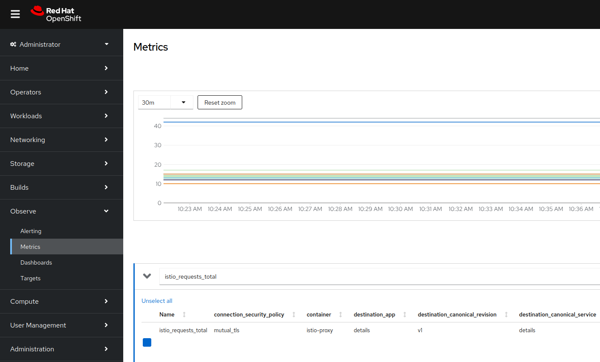

# Prometheus

This document tells you how to migrate your `ServiceMeshControlPlane` from the Prometheus addon to a self managed Promethues in preparation for migrating from Service Mesh 2.6 to 3.0.

<!-- NOTE to doc reviewer: these instructions are largely the same as https://docs.redhat.com/en/documentation/openshift_container_platform/4.13/html/service_mesh/service-mesh-2-x#ossm-integrating-with-user-workload-monitoring_observability. Some of the examples have been updated and the Kiali specific portion of the docs will be separate from the OSSM specific portion of the docs. These are the OSSM specific portion of the docs. -->

## Prerequisites

- User Workload Monitoring has been [enabled for user-defined projects](https://docs.openshift.com/container-platform/4.16/observability/monitoring/enabling-monitoring-for-user-defined-projects.html).
- Network Policy management has been [turned off](TODO-link-to-turning-off-net-policies) on your `ServiceMeshControlPlane`.

## Procedure

<!-- Developer instructions for testing with a fresh 2.6 install.

1. Create SMCP namespace

```sh
oc create ns istio-system-tenant-a
```

1. Create SMCP

```yaml
apiVersion: maistra.io/v2
kind: ServiceMeshControlPlane
metadata:
  name: basic
  namespace: istio-system-tenant-a
spec:
  security:
    manageNetworkPolicy: false
    dataPlane:
      mtls: true
  addons:
    grafana:
      enabled: false
    kiali:
      enabled: false
    prometheus:
      enabled: true
  gateways:
    openshiftRoute:
      enabled: false
  mode: MultiTenant
  policy:
    type: Istiod
  profiles:
    - default
  telemetry:
    type: Istiod
  tracing:
    type: None
  version: v2.6
```

1. Create bookinfo namespace

   ```sh
   oc create ns bookinfo
   ```

1. Add bookinfo to the SMMR

   ```yaml
   apiVersion: maistra.io/v1
   kind: ServiceMeshMemberRoll
   metadata:
     name: default
     namespace: istio-system-tenant-a
   spec:
     members:
       - bookinfo
   ```

1. Deploy bookinfo

   ```sh
   oc apply -n bookinfo -f https://raw.githubusercontent.com/Maistra/istio/maistra-2.6/samples/bookinfo/platform/kube/bookinfo.yaml
   ```

1. Ensure pods are all healthy and you see `2/2` pods indicating a sidecar was injected.

   ```sh
   oc get pods -n bookinfo
   ```

   Example output

   ```sh
   NAME                             READY   STATUS    RESTARTS   AGE
   details-v1-75cb5b97b4-5c6nm      2/2     Running   0          6h13m
   productpage-v1-899d756d8-ch424   2/2     Running   0          6h10m
   ratings-v1-58757c649b-8bdg4      2/2     Running   0          6h13m
   reviews-v1-6878c868b6-42kw7      2/2     Running   0          6h13m
   reviews-v2-6c8bd45654-jpt76      2/2     Running   0          6h13m
   reviews-v3-57997d6ccd-j6pmh      2/2     Running   0          6h13m
   ```
-->

### User Workload Monitoring

User Workload Monitoring is a production ready monitoring solution in OpenShift that is a drop in replacement for the `ServiceMeshControlPlane` prometheus addon.

1. If you have a `MultiTenant` `ServiceMeshControlPlane` ensure you have set a unique value for your `meshID`.

   ```yaml
   apiVersion: maistra.io/v2
   kind: ServiceMeshControlPlane
   metadata:
     name: basic
     namespace: istio-system-tenant-a
   spec:
     ...
     mode: MultiTenant
     techPreview:
       global:
         meshID: basic-istio-system-tenant-a
   ```

   Setting `meshID` will help ensure that when you store telemetry from different meshes in a shared metrics store, like User Workload Monitoring, you can still distinguish between each mesh. Here we have used `<smcp-name>-<smcp-namespace>` for our `meshID` but any unique value can be used.

1. Create a `Telemetry` resource to ensure your proxies continue to export metrics after the Prometheus addon on the `ServiceMeshControlPlane` has been disabled.

   ```yaml
   apiVersion: telemetry.istio.io/v1alpha1
   kind: Telemetry
   metadata:
     name: mesh-default
     namespace: istio-system-tenant-a
   spec:
     metrics:
       - providers:
           - name: prometheus
   ```

   If you have a `MultiTenant` `ServiceMeshControlPlane`, you modify your `Telemetry` resource to add a `mesh_id` label to all metrics to distinguish between different tenants. This label comes from the `techPreview.global.meshID` field on your `ServiceMeshControlPlane`.

   ```yaml
   apiVersion: telemetry.istio.io/v1
   kind: Telemetry
   metadata:
     name: mesh-default
     namespace: istio-system-tenant-a
   spec:
     metrics:
       - overrides:
           - match:
               metric: ALL_METRICS
             tagOverrides:
               mesh_id:
                 value: node.metadata.MESH_ID
         providers:
           - name: prometheus
   ```

1. Apply a `ServiceMonitor` object to monitor the Istio control plane:

   Create this ServiceMonitor object in the Istio control plane namespace because it monitors the Istiod service. In this example, the namespace is `istio-system-tenant-a`.

   ```yaml
   apiVersion: monitoring.coreos.com/v1
   kind: ServiceMonitor
   metadata:
     name: istiod-monitor
     namespace: istio-system-tenant-a
   spec:
     targetLabels:
       - app
     selector:
       matchLabels:
         istio: pilot
     endpoints:
       - port: http-monitoring
         interval: 30s
   ```

1. Apply a `PodMonitor` object to collect metrics from Istio proxies in every namespace that is part of your `ServiceMeshMemberRoll`.

   Since OpenShift Container Platform monitoring ignores the `namespaceSelector` field in the `ServiceMonitor` and `PodMonitor` objects, you must apply the `PodMonitor` object in all mesh namespaces, including the control plane namespace.

   ```yaml
   apiVersion: monitoring.coreos.com/v1
   kind: PodMonitor
   metadata:
     name: istio-proxies-monitor
     namespace: bookinfo
   spec:
     selector:
       matchExpressions:
       - key: istio-prometheus-ignore
         operator: DoesNotExist
     podMetricsEndpoints:
     - path: /stats/prometheus
       interval: 30s
       relabelings:
       - action: keep
         sourceLabels: [__meta_kubernetes_pod_container_name]
         regex: "istio-proxy"
       - action: keep
         sourceLabels: [__meta_kubernetes_pod_annotationpresent_prometheus_io_scrape]
       - action: replace
         regex: (\d+);(([A-Fa-f0-9]{1,4}::?){1,7}[A-Fa-f0-9]{1,4})
         replacement: '[$2]:$1'
         sourceLabels: [__meta_kubernetes_pod_annotation_prometheus_io_port,
         __meta_kubernetes_pod_ip]
         targetLabel: __address__
       - action: replace
         regex: (\d+);((([0-9]+?)(\.|$)){4})
         replacement: '$2:$1'
         sourceLabels: [__meta_kubernetes_pod_annotation_prometheus_io_port,
         __meta_kubernetes_pod_ip]
         targetLabel: __address__
       - action: labeldrop
         regex: "__meta_kubernetes_pod_label_(.+)"
       - sourceLabels: [__meta_kubernetes_namespace]
         action: replace
         targetLabel: namespace
       - sourceLabels: [__meta_kubernetes_pod_name]
         action: replace
         targetLabel: pod_name
   ```

1. Verify that your dataplane workloads show as Metrics targets in the OpenShift Console.

   1. Open the OpenShift console.

   1. Navigate to the Observe --> Targets tab on the leftside navigation menu.

   1. Query for your workload namespace e.g. `bookinfo` and ensure your workloads are listed and the `Status` is `Up`.

      

1. Verify you can query for `istio_requests_total` in the OpenShift Console.

   **Note:** you will need actual traffic flowing through your mesh for this step to work. It can also take a few minutes for the metrics to appear in the metrics dashboard once a request has been made.

   1. Open the OpenShift console.

   1. Navigate to the Observe --> Metrics tab on the leftside navigation menu.

   1. Query for `istio_request_total` and ensure you see results returned.

      

   1. If you have a `MultiTenant` `ServiceMeshControlPlane`, ensure the `mesh_id` field is present in the metrics.

   Now User Workload Monitoring is storing your workload metrics and you can disable the `prometheus` addon.

1. Disable the Prometheus addon in your SMCP.

   Here we are disabling the default Prometheus instance provided by OSSM and modifying `meshConfig` to ensure metrics continue to be exported.

   ```yaml
   apiVersion: maistra.io/v2
   kind: ServiceMeshControlPlane
   metadata:
     name: basic
     namespace: istio-system-tenant-a
   spec:
     ...
     addons:
       prometheus:
         enabled: false
     meshConfig:
       extensionProviders:
         - name: prometheus
           prometheus: {}
   ```
